# OpenCascadeLink for the Wolfram Language

The [Wolfram Language](https://www.wolfram.com/language/) has built-in support for the Finite Element Method. OpenCascadeLink is a package that provides computational geometry functionality to generate 3D boundary meshes for the finite element method. OpenCascadeLink ships with version 12.1 and later versions of Wolfram Language deployments for the desktop, including [Wolfram Desktop](https://www.wolfram.com/desktop/) and [Mathematica](https://www.wolfram.com/mathematica/). In other words, if you just want to make use of OpenCascadeLink there is not need to clone this repository as OpenCascadeLink is already part of, for example, [Mathematica](https://www.wolfram.com/mathematica/). The current [Documentation of OpenCascadeLink](https://reference.wolfram.com/language/OpenCascadeLink/tutorial/UsingOpenCascadeLink.html) can be viewed online. If, on the other hand, you would like to add new functionality to OpenCascadeLink then you need this repository.

### Installing and Updating the OpenCascadeLink release

The process of building OpenCascadeLink in part or full from source and subsequently installing it is documented in the notebook BuildOpenCascadeLink.nb

### Using OpenCascadeLink 

To access the documentation, open the notebook interface help viewer, and search for OpenCascadeLink.

OpenCascadeLink provides computational geometry functionality. Here is an example usage:

	Needs["OpenCascadeLink`"]
	shape1 = OpenCascadeShape[Ball[{1, 0, 0}]];
	bmesh1 = OpenCascadeShapeSurfaceMeshToBoundaryMesh[shape1];
	bmesh1["Wireframe"]

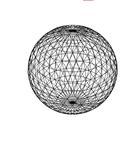

Volumes and surfaces can be meshed.

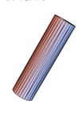
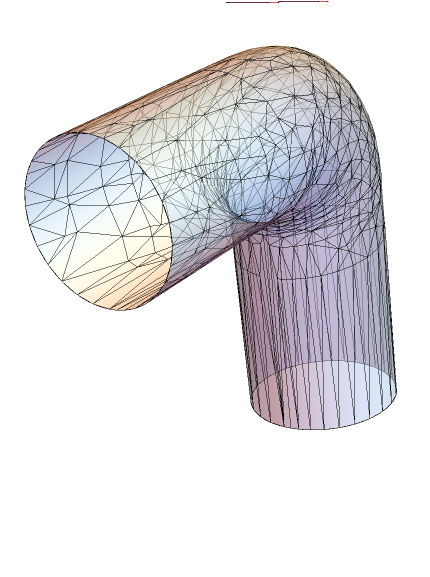

Sweeping and Boolean operations with material regions are supported.

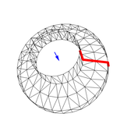
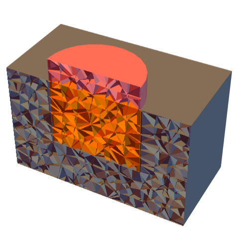

Fillets, champfers and shelling are supported.

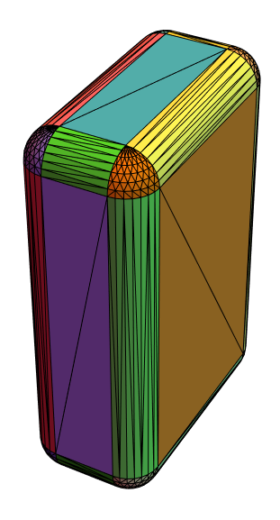
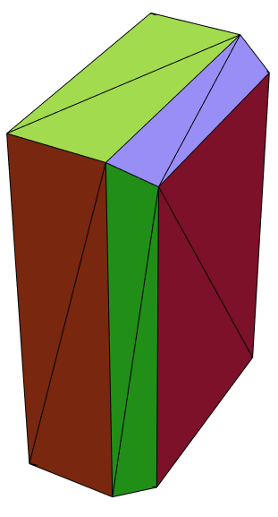
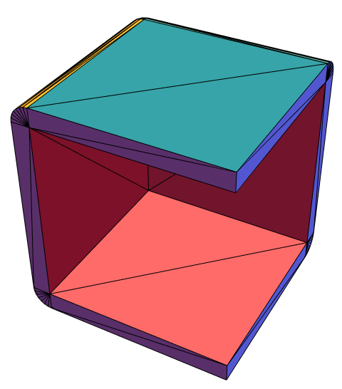

De-featuring is supported.

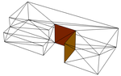
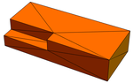

Importing of STEP files is supported.

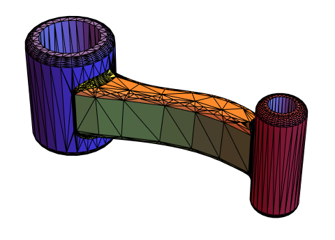

### More...

See the following files for more information:

* [License.md](License.md) - OpenCascadeLink license
* [Contributing.md](Contributing.md) - Guidelines for contributing to OpenCascadeLink 
* [HowToBuild.md](HowToBuild.md) - Instructions for building and debugging OpenCascadeLink 
* [Acknowledgements.md](Acknowledgements.md) - Acknowledgements 
